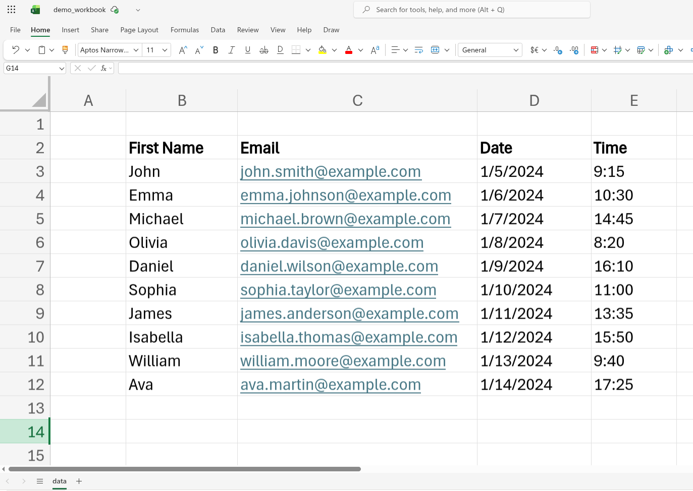

## Introduction

At some point in my career, I conducted interviews that had to be completed within one week. On average, they used to be around 55 - 65 sessions, spanning 30 minutes each, from Monday to Friday. It used to be a long week, but what made it even more tiring was setting up the meeting invites and sending follow-up text messages to all the candidates informing them they have an interview, and they should look at their email for more details.
When I used to do it manually, I would spend like 3 hours each day, sending email invites and text messages for candidates I’m interviewing in the next two days e.g. On Friday, I would send emails to candidates I’m interviewing on Monday and Tuesday, and on Monday, I would send invites for those that I’m interviewing on Wednesday and Thursday etc. This was a very tedious process, and it goes without saying how exhausting the interviews were (lasting between 8 AM and 5 PM).

So I thought, there has to be a way to automate stuff like this on Microsoft Teams. And yes, there was a way. But the process is not well documented, and I had to piece a lot of information together from different parts of the internet; blogs, community threads, comments on Microsoft blog posts etc.

This article is about how to schedule multiple Teams meetings together (God bless you if you have more than 50 interviews in a week), using a Microsoft application called **Power Automate**.

## Prerequisites

This article doesn’t assume much technical knowledge, but you should understand the basics of how to use Microsoft 365 applications (i.e., Excel) and understand programming (a bit). It’s a fairly easy process that you should be able to follow through, I hope.
The other assumption is that you have a paid subscription to Microsoft 365 (individual or business plans).

## Step 1 - Prepping the Tools and Data

The tools/applications we will use all belong to Microsoft i.e. **Power Automate**, **Excel**, **Word** and **Teams**. They should all be accessible once you log in to your Microsoft Account. 

In Excel, we store our data, which is basically user information that we will use to schedule Teams meetings. The data contains the following columns: first name, email, a date, and a time field (for when to conduct the interview). You can generate this data using AI. Here’s a sample that we will use, which contains 10 records:



Since we’re going to schedule meetings with these 10 people, we will be sending an email containing details about our meeting. We can use the following draft from AI:


Now we can proceed to the next step, on setting up the workflow.

## Step 2 - Building the Workflow on Power Automate

In simple terms, Power Automate is a service provided by Microsoft to help users automate repetitive tasks and business processes by connecting different apps that work together (more about it here: [link](https://www.microsoft.com/en-us/power-platform/products/power-automate)).

To start off, log in to your Microsoft account, and navigate to the apps in the *Productivity* category, where you will find Power Automate. This is the kind of dashboard you can expect:


Click on ‘**+ Create’** button at the center, or on the left, to start a new workflow.

We’re presented with three ways to make a flow, and we’re going to use the first option, which is *start from blank*, and we will select the second option reading ‘*Instant cloud flow*’.


We’re presented with a dialog box, and we get to give our flow a name, and also choose how to trigger it. We can name it ‘*demo*’, choose the first option: ‘*Manually trigger a flow*’, and then select ‘*Create’.*


What we have done so far is create a workflow that will be manually triggered by us. There are other ways to trigger a workflow, like scheduling at a specific time, or having a workflow triggered by another service, etc.

Now we’re directed to a blank canvas, and this is where we will specify the actions we want to take in our workflow. One action already appears, and that is the ‘*Manually trigger a flow’ .*


We’re going to define two more actions: one that loads data from the Excel workbook, and another that creates the Teams meetings.

To load data from the Excel workbook, click on the plus sign, and from the pop-up menu on the left, search for ‘*excel’*, and then select the ‘*List rows present in a table*’.


The action is added on canvas, and a new pop-up appears on the left, where we specify parameters that define where our data is located. Depending on where your data is stored, fill in the first three parameters, and in the fourth field titled ‘*Table*’, we need to make some adjustments before we can fill it (if you try, you might realize nothing appears on the dropdown). So what we need to do is add the data we have in our Excel file to a table. In that Excel file, select your data accurately (from the cell it starts to the one it ends), and from the Menu bar, select *Insert,* and then select *Table.* A small pop-up appears asking whether the table has headers, and select *OK*. 


The table has been created, and there could be some color changes to your data. Selecting any cell that has your data will bring up the *Table Design* option in the *Menu* bar. When you select it, a table name field appears on the far left, which can be changed to something else you desire i.e. changed mine from *Table1* to *dummyTable.*


Now we can go back to our workflow, and in the *Table* field, the *dummyTable* should appear (if it doesn’t, re-enter the previous fields, so that changes can reload).


When the workflow is ran, this action above would retrieve data from the Excel workbook, in the table containing our data. For our case, we want to use that data to schedule Teams meetings, and so the next action we will create is a Teams action. Click on the *Plus* icon, below the Excel action, and then search for *teams*, and select the first choice ‘*Create a Teams meeting*’.


Once it’s added, there’s some little work to be done from here. So this is supposed to schedule the Teams meetings, which usually happen through an email invite. In the pop-up that appears from the left, we will fill in the details that will be sent as part of our email.

1. The first field is the *Subject*, which is basically the title of the email. Now a good practice here, if you’re trying to schedule like 50 meetings at a go, is to somehow add the name (or an ID) of the users as part of the subject. This helps you know who you’re having a meeting with in your Teams calendar i.e. If all the meetings had the title ‘*Interview Session’ ,* it would note be easy to know whom you’re meeting with if you just look at the calendar (and also sometimes might be hard to trace back when you had a meeting with someone). Inside the field, after selecting it with the cursor, the field is surrounded by a blue border, and two icons appear on the left. Select the first **icon, which allows you to add data from the previous step. 


A pop-up on the right appears, which shows various fields from the previous two actions. Select ‘*see more’* from the Excel action so that you can view all the columns present in the table.


 **

Now, you should be able to see the 4 fields from your table e.g. First Name, email, and now select *First Name*.


Once you select it, it’s added to the Subject field, and you can think of it as a variable. Next to it you can add more text i.e. you can add this extra text in front of it: ‘ *- Interview Session*‘. This means that, when the workflow runs, the Subject of the email that is sent will be dynamic, depending on the user e.g. for a user with the first name derrick, the subject would read ‘*derrick - Interview Session’,* and this would also be the meeting title when viewed on the Teams calendar.

Also, the ‘*Create a Teams Meeting*’ action has changed on the canvas; it’s now wrapped with a *For each* structure.


b. The next field is the message body, where we can paste in the content we got earlier. However, since this is an email body, text is processed as HTML, and since this is not a generic message, we ought to do some formatting so that links, bullet points, and some important words/text become more pronounced. We can copy that whole text from ChatGPT, and paste it in some online converter (e.g. [link](https://wordtohtml.net)) that would convert it to HTML. From the message text, where we start off with ‘*Dear [candidate name]*’, we can replace *candidate name* with a dynamic field of the actual user, as we did in the previous step.  Here’s the final result:


c. The next field is the *Time zone*, where we get to select the meeting’s timezone.

d. The *Start time* field and *End time* field are both required, and in the two fields you have to provide a full timestamp. These fields are also specific to each user, since no two candidates will have a meeting at the same time with you. In the Excel workbook, we can add an extra column, one for the start time, and one for the end time. You can use the following two formulas to calculate the start and end times in the correct format: 

```jsx
// start time
CONCAT(TEXT([@Date],"YYYY-MM-DD"),"T",TEXT([@Time],"HH:MM:SS"))

// end time
CONCAT(TEXT([@Date],"YYYY-MM-DD"),"T",TEXT([@Time]+TIME(0,30,0),"HH:MM:SS"))
```

The output should look like the following (duration of the meeting invites is 30 min):


Back in the demo flow, we can give it a few minutes to refresh (or manually refresh, by going back to the previous Excel action, and entering the parameters again to load the file). In the field, select *Calendar* as the value for *Calendar id,* and this should be the output you’re getting:


e. The last step is to specify the required attendees of the meeting. Each invite will be sent to each user, through email. At the bottom, where we have the *Advanced parameters* section, click on the drop-down, look for *Required attendees*, and select it. A new field emerges at the bottom for *Required attendees* where will specify the emails of the users. Again, this is a dynamic field, and we have to reference the email column from the Excel workbook (in case the blue border and the hazard icon don’t appear after selecting the field, click on the settings icon at the top right of that field, and select the dynamic option, they should now appear).


## Step 3 - Run the Workflow

The hardwork is done, now we can run the workflow. Start off by saving the flow - look for a save button at the top right of the page. Once it’s saved, selecting *Test* would literally run the workflow, and the mails will be sent to the users.

I have modified the data timelines, and the last user, so that we can see changes on Teams, if the meetings were happening on the same day, and also how the invite looks on email.


Select *Test* at the top right, in the *Test Flow* pop-up choose *Manually* and select *Test* at the bottom, which confirms credentials are right, and then select *Run flow*.

Once the Flow starts, you can monitor progress in the same page, and if you had no errors, the flow should be complete in like 30 seconds.


Now here’s how Teams looks after running the workflow:


And here’s the email on the candidate’s side:


## Conclusion

So that’s it about autoscheduling meetings using Power Automate. Pretty neat, don’t you agree?