I'll try to keep the walkthroughs brief. That being said, in case of any questions, suggestions or improvements, ping me on my X account.<br />
Rightio then:

## # Challenge 1 - Vibe Coder
### TLDR
So this was a website, running express in the backend (you could tell from the headers), and a simple login page.
Now if you fuzz a little, you would discover a `/dashboard` path, that obviously wouldn't allow you to access it without being logged in.
One way to go about it is to forge a jwt token cookie, and since jwt signing was disabled, you would login as `admin` with the following fields set in the user data field in the jwt: 
- `username` could be anything i.e. `cat`
- `isAdmin` had to be set to `true`

### Methodology
We are provided with a link, which upon opening, we have this login page:


If you try to login with any set of credentials, we get an invalid credentials error:


When you look at the source of the page, we just have a very simple html file, which loads a generic css file. At this point, it’s good we try to understand the stack running this website. One way to achieve this is to have a look at the raw requests, and see if there’s any unique header. Fortunately, there's one: `X-Powered-By`
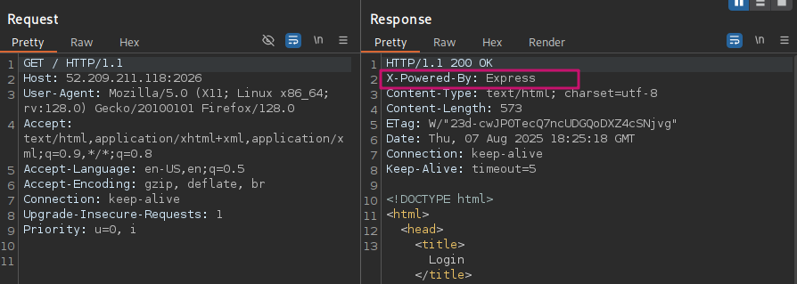

Now we know we’re running `Express`, which is a JS middleware, and we can now try to do further enumeration. I’ll do a directory fuzz. Something worth noting is that if we try to hit an invalid endpoint, we get an error response that prints out the characters that we provided as the path. 
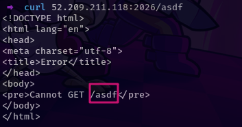

I initially tested out SSTI and XSS payloads but that was a dead end; input is well sanitized.
So, next we can query for paths using various tools, I’ll use `feroxbuster`:


There’s a dashboard, which kind of makes sense, since we’re being asked to authenticate. Now, before I figured out the intended way of solving this challenge, I took a lot of time with what I already knew here. If you try to access the dashboard endpoint, you get redirected to the login page, hence the 302 response. I started poking around with the dashboard, and I first asked chatGPT what kind of authentication Express applications support and the structure of the auth cookies. Here’s the response:
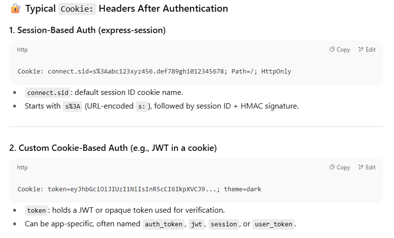

I tried to forge these cookies, to just prompt a response from the server and see if I’ll get something, and luckily, I got something interesting (previously, the app was handling requests to non-existents paths very well, with a 404 not found page).
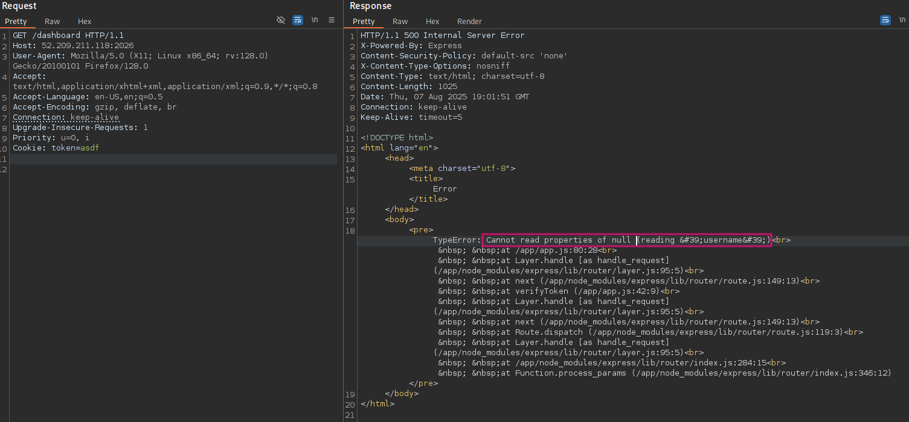

It revealed the stack trace to us, which shows the underlying directory structure, but most importantly, that a username is required in our token. So I went to [jwt.io](https://jwt.io), and crafted a simple JWT:


Feeding this to our website, we get an interesting response - we’re now authenticated, our username is printed out, but there’s also a message saying we’re not admin:
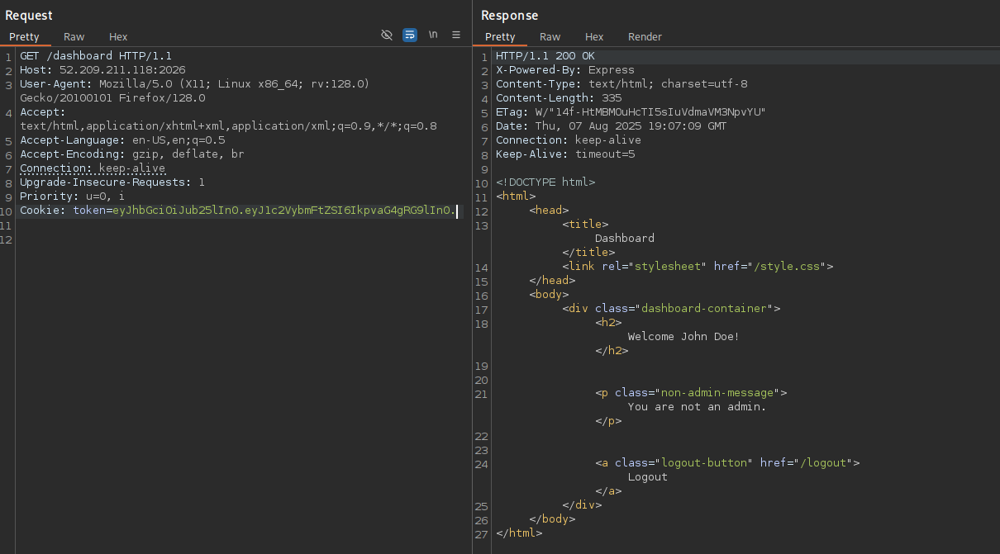

At this point, you can tell the dashboard doesn’t reveal anything, since we’re not admin. One could try to set the username to admin and see what comes up, but that wouldn’t work (‘one’ is me, it didn’t work). But, if you’ve interacted with JWTs before, usually you set an admin property in the JWT, and that’s like the normal way these applications work. So we can try adding an admin property in the JWT data field, and see if anything changes. There are many ways to try that, through a role key, admin key, isAdmin key, and the values could be true or 1 . Trying this out, isAdminworks out and we get our flag:


### Intended Way!?
Express middleware is quite robust, and you can tell from this app if you try directory fuzzing.
If an arbitrary endpoint such as `/path` is only enabled through GET requests, sending POST requests will return a 404 Not Found i.e.


So we could have an existing path like `/path/to/existing_path` but trying to `GET /path` will return a 404, which means that our directory fuzzers might not hit anything (I was using `feroxbuster` and `ffuf`).

At some point, I randomly thought of using `nmap` to run some default scripts since it might help fingerprint the application stack running this web server. To my surprise, we got a hidden path:
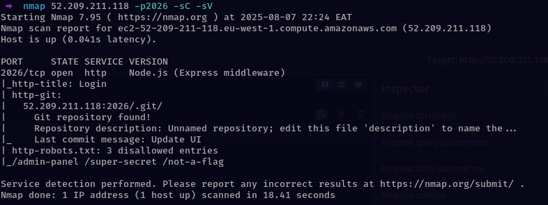

Nmap reveals a `.git` repo. From there, it would be easy to understand what’s going on in our web app. Download the git repo using `git-dumper`
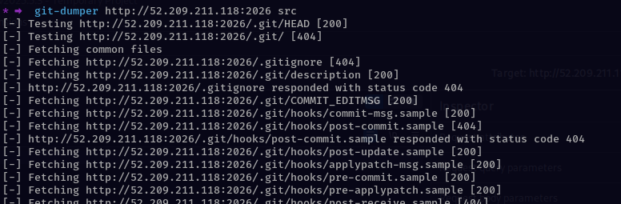

Looking at the source code, you would discover hidden credentials in the commit messages i.e.
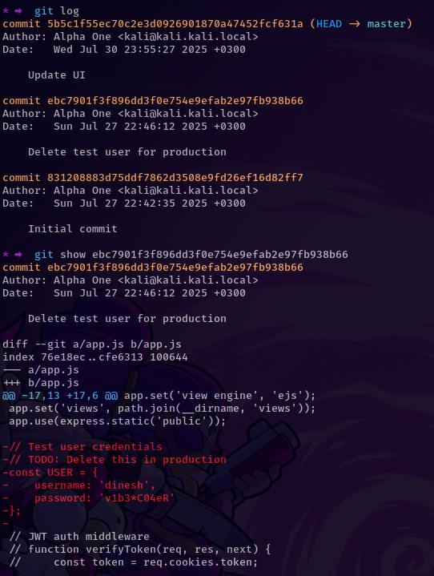

From there, you login with those credentials, which are valid but it turns out that `dinesh` isn’t the admin. Looking through the source code, we find that JWT signature verification is disabled, therefore we just need to modify our cookie to have the right header and data fields, as done previously in the first step, and that should allow us to authenticate as admin:
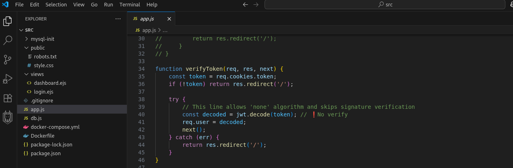

~THE END~

## # Challenge 2 - Captcha The Flag
### TLDR
In this challenge, there were three challenges we had to overcome.
1. First, you had to identify a `/debug` path that would allow you to set an ip address such that you can login without solving the captcha.
2. Discover the login page was vulnerable to blind sql injection, but was being protected by a web application firewall
3. Now the awesome part, crafting queries that would bypass the WAF and also leak the database

### Methodology
Accessing the endpoint, we're directed to a login page:
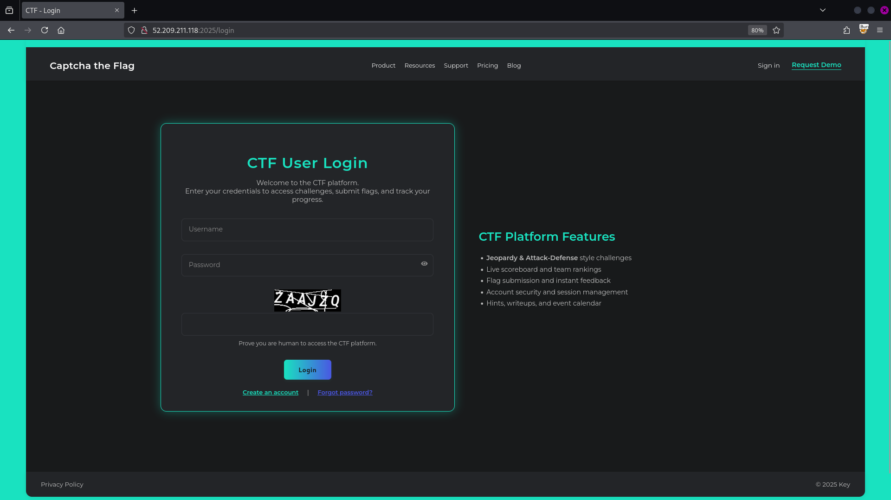

If we try to login with random creds but without solving the captcha:


We have to enter our username, password and also solve the captcha, and trying out with random creds, we get an error:


At the bottom, we have a create account link (the ‘forgot password’ link is disabled), and we can try to create an account, I’ll use `cy00p:cy00p`:


After registering, we’re redirected to the login page, and we can now try to login with our valid creds:


This page doesn’t have much, and we’re told that we probably need to login as admin to find some good stuff.
When we look at burpsuite, and view the request headers, the server is running `Werkzeug/3.1.3 Python/3.11.13`, a python server framework.


At this point, I thought of trying to do some fuzzing and see if we can identify any valid endpoints, I’ll use `feroxbuster`:
We discover the `/debug` path, which is kind of interesting. When we make a GET request to that path, we get our IP address returned to us and some interesting info:
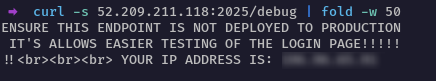

From that text, we get a hint that this `/debug` path was probably supposed to be disabled, since it might interfere with the login page somehow.
After giving it some thought, I decided to test out various HTTP methods on that path, and the response to a `POST request` was intriguing:


The POST method is enabled, and is asking us to provide an IP address.
Based on the previous sign in requests, the content type was `x-www-form-urlencoded` , so we can set that header and provide the IP address in the data field (using `curl`, we don’t have to set the content type though):


Our IP address has been added to the database, but what does that mean? Let’s try to visit the login page, and try to login again, this time we enter a random username and password, but without solving the captcha:
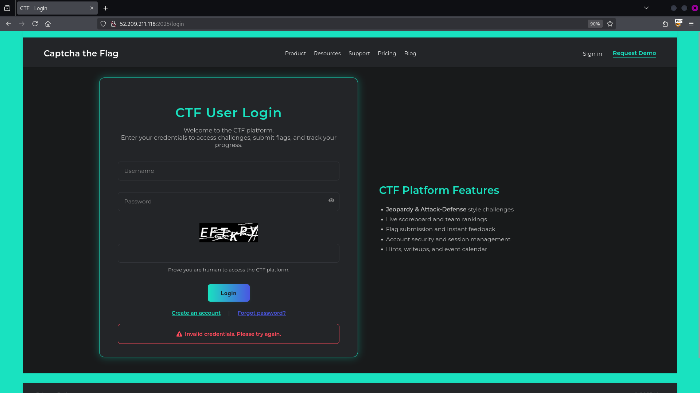

Apparently, the error we get is invalid credentials, and not invalid captcha. So setting our ip address in the debug endpoint helped us bypass the captcha.
One problem solved, another challenge awaits. So, what we can do from here?

#### SQL Injection
In BurpSuite, when we try to login, having scrapped off the data fields with captcha info, and without setting the IP in the debug path, we get a `500 Error` Response:


But after we set the IP address through the debug endpoint, we get a 200 OK message, and in the response we have the text `Invalid Credentials. Please try again`.
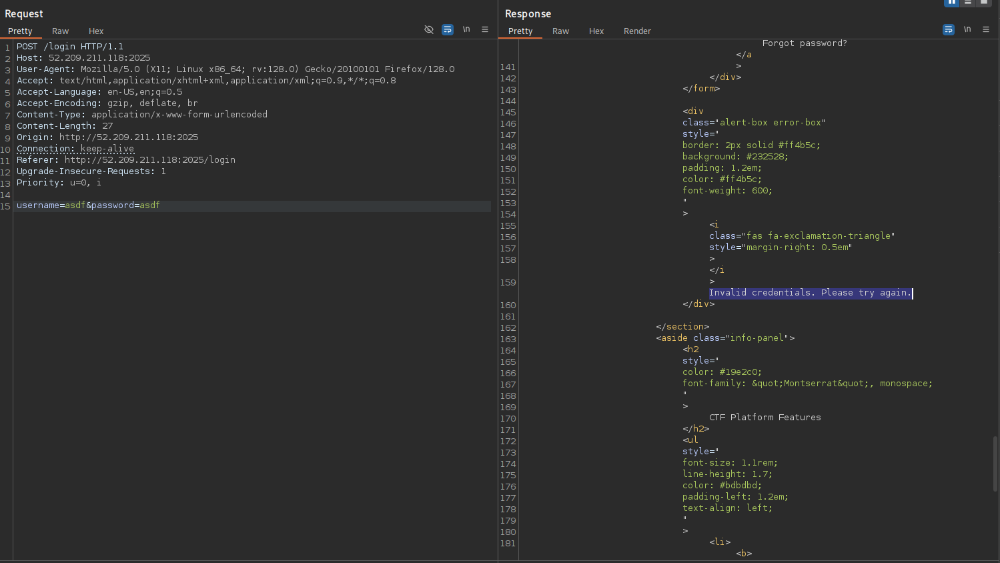

At this point, we can now start playing around with the form fields. We’ll test for sql injection, and I’ll use a “ or ‘ to test if the server is going to error out. A `"` returns a 200 OK response, but we get a message that `WAF detected SQL injection. Please try again.`


We have a web application firewall probably protecting the web server against injection attacks. However, sending a single quote `'`  returns a 500 Error, which means that it wasn’t part of the blacklisted characters or strings of the web application firewall.


At this point , I felt injection was possible. But first, we need to get a valid injection string, that can bypass the WAF, but also not error out the server. After trial and error, I got something, and this actually confirmed that we're dealing with a sqlite database:


The `||` is a concatenation operator in sqlite, meaning it's used to combine two strings i.e. a query `select "aa"||"bb"||"cc"` would yield `aabbcc`
With that done, we can try to pass in a string after the `||` operator, and and maybe comment out the rest of the query using `-- `.
> if you pass in the payload like this `'||'asdf'-- `, the WAF would error out because of the `-- ` at the end. But if you put the string in parenthesis, i.e. `'||('asdf')-- `, it calms down. I can't explain why 🤷‍♂️.

We can now login as admin:


The admin page doesn't have anything interesting, so we can go back to our database and try to extract more info.

#### Error-based Technique
Inside the parenthesis, we can replace that `admin` string with an sql query that returns a string i.e. we can try to put `select sqlite_version`
> The image below has a different structure of queries. My bad, it was very late when I was writing this. Putting one pipe character `|` is still valid, but it does a bitwise XOR operation on sqlite. It can still be used to build valid queries, but it's better to use the double pipe characters `||` to do a concatenation and construct more meaningful queries.


When a query is valid, we get a `200 OK` response with that invalid credentials text, and when it's not, we get a `500 INTERNAL SERVER ERROR`.<br />
We can use this error-based technique to extract the database contents, and we would need to write a script (`sqlmap` was just going bananas here, pretty sure it's a skill issue).<br />
How I proceeded from here to get the flag is a bit hilarious though (I did a lot of trial and error, the steps might be a bit shallow but I hope you get it);
1. I made the assumption that we had a table called `users`, and there's a high chance we have the columns `id`,`username` and `password`, right?
2. The string 'password' was blacklisted by the WAF, but since both fields are injectable, I thought about using both fields to build a query (overthinking at its best lol), and IT WORKED
```python

return f"username='||(SELECT username FROM users WHERE id LIKE 21 AND &password= LIKE '"+payload+"')--"


```


A lot is going on here. The reason I'm using `LIKE` to write the conditions is because our WAF had blocked logical operators i.e. if you tried to do `id=1`, you would get a WAF error. By the time I was attempting this challenge, my id was `21` ( found out after running some other queries), and I just wanted to confirm if I can correctly extract my password through this. In the payload section, I would bruteforce the characters, and terminate with a `%`, which is a wildcard in sql.

3. My password was supposed to be `cy00p`, and before I started using the script, the payload `c%` was producing an error on BurpSuite. Something was off. I couldn't tell what was going on, so I decided to proceed running the script.

4. After the script run, we got the column name `__authpw__` instead of the actual password (no screenshot here, instance was already down). Huh, well I can't explain it but hey, we got the column name.
5. So I just modified the script to get the admin password and voila!
```python

return f"username='||(SELECT username FROM users WHERE id LIKE 1 AND authpw LIKE '"+payload+"')-- &password="


```


#### BETTER WAY
Later on I decided to think of a better way to extract data in this scenario, turns out there was. <br />
After looking at this [repo](https://swisskyrepo.github.io/PayloadsAllTheThings/SQL%20Injection/SQLite%20Injection/#sqlite-error-based), we can use 'CASE', which is similar to `if` conditions in other langs, to extract info from the db.
Here's a sample payload that you could use:
```sql

AND CASE WHEN [BOOLEAN_QUERY] THEN 1 ELSE load_extension(1) END


```
In the boolean query, you could try sth like this: `'a' LIKE 'a'`, which evaluates to `true` and the server doesn't crash, while `'b' LIKE 'a'` evaluates to false, and we get a `500 ERROR`<br />
With [pragma functions](https://sqlite.org/pragma.html), you can extract all the db tables, columns, and then all the records present.<br />
An example of a payload to extract columns from a table `users` looks like this:

```python

return f"username='||(CASE WHEN (SELECT GROUP_CONCAT(name) FROM pragma_table_info('users') ) LIKE '"+payload+"' THEN 1 ELSE load_extension(1) END)-- &password="


```
After tinkering around, I extracted three tables (`whitelistedip, users, sqlite`) and the `users` table had three columns: `id, username, authpw`


## Conclusion
These were great challenges, huge shoutout to [ChasingFlags](https://linkedin.com/company/chasingflags/).