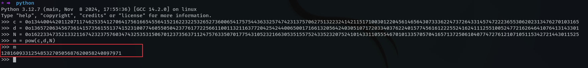

## Introduction 
I set out two cryptography challenges for p3rf3ctr00t ctf 2024. My challenges had one solve, which is hilarious. `Goated` had one solve, and I actually believe it was the harder challenge. Both were ranked `easy`, so, I guess I'm bad at setting easy challenges.

## Prerequisites
I'm gonna assume you love cryptography, God knows for what reason. Also, it's a technical article covering Python programming and requires some basic Maths understanding.

## # Challenge 1 - Purr

### Challenge Description

Read through the lines

Somebody is saying something

Are you listening?

### Files

purr.py

```python
from Crypto.Util.number import getPrime, isPrime, bytes_to_long
import random
import secret

p = bytes_to_long(secret.MESSAGE)
q = getPrime(len(bin(p)))
e = 0x10001
m = 0

random.seed(e)

while not isPrime(p):
        p += int(str(m)[:3])
        m += random.randint(e,e**8)

N = p*q
d = pow(e,-1,(p-1)*(q-1))
c = pow(m,e,N)

for i in (c,d,N):
        print(f"{i:o}")

"""
OUTPUT
13440044201120711746253541270641756166545564152162232253265273600654175754436332574742313757062751322324142115171003012204561465643073336224737264331457472223655306202313476270103165
13657206345673614157356155137415231007746055050423776177225661100113211637720425424400650017166132056424030510717203340376224015774561612225524162411125510052477216264641076413143301
16223347352133211674232375760347432535315067012373563711247576335070177543105232166305351557524335232075241014331105554670101335705704165713725061040774727612107105115342721443011525
"""
```

### Flag

`{4420adaf23b2dee057a27f16fb028470}`

### Solution

**TLDR**

This challenge involves asymmetric encryption (RSA), and since we’re provided with the values of `c,d,e,N`**,** we should be able to recover the values of `m` and `p,q`. The secret message was initialized as `p`, so we can reverse the logic that was done to it to make it a prime number, by subtracting every pseudo-random number generated till we get to the value `m`. 

Normally, I would create a test environment with dummy data to work with such challenges, but with this one, it’s relatively easy to work from the bottom. I’ll start by recovering the value of `m`. It’s worth noting the last print statement is giving us output in *octal* format, which I did intentionally ~~you had to suufffer~~. To reconvert from *octal,*  prepend the prefix `0o` to the numbers, and we can then recover `m` with the formula `pow(c,d,N)`



Next, we need to recover the primes `p` and `q`, and since we know the value of `N,e,d`, recovering the primes should be easy. I’ll use the module `Crypto.PublicKey.RSA` to do this (you can install `pycryptodome` to get access to this module).


We needed to get the values of `m` and `p,q`, in order to reverse this logic below, which should then give us our secret message as the initial value of `p`. What’s happening here, is that the value of `p` is being incremented with the first three characters of `m`, and `m` is being incremented with a random number on each iteration. The iteration stops when `p` becomes a prime.

```python
while not isPrime(p):
        p += int(str(m)[:3])
        m += random.randint(e,e**8)
```

Since our random numbers were *seeded* insecurely, we can generate the same random numbers again using the same seed, which is `e`.  To reverse this whole process, I’ll create a variable `t` that would start from zero, subtract it from `p`, continuously increment it with a random number using the same formula as used on `m`, and then to exit from the loop, I’ll compare if the value of `t` is equal to the value of `m`. (I’ll decrement both `p` and `q` in this logic since either of them could be the secret message).


 

The last step now is to decode the values of `p` and `q` to get our flag


Here’s the summarized script:

```python
from Crypto.Util.number import long_to_bytes
from Crypto.PublicKey import RSA
import random

## load output, converting from octal base
c = 0o13440044201120711746253541270641756166545564152162232253265273600654175754436332574742313757062751322324142115171003012204561465643073336224737264331457472223655306202313476270103165
d = 0o13657206345673614157356155137415231007746055050423776177225661100113211637720425424400650017166132056424030510717203340376224015774561612225524162411125510052477216264641076413143301
N = 0o16223347352133211674232375760347432535315067012373563711247576335070177543105232166305351557524335232075241014331105554670101335705704165713725061040774727612107105115342721443011525

## known variables
e = 0x10001
random.seed(e)

## recover m
m = pow(c,d,N) # print(m)

## recover p,q
rsa = RSA.construct((N,e,d))
p,q = rsa.p,rsa.q # print(f"{p = }\n{q = }")

## extract either of p or q
t = 0
while True:
				q -= int(str(t)[:3])
        p -= int(str(t)[:3])
        t += random.randint(e,e**8)
        if (t == m):
                break

## decode message
for i in (p,q): print(long_to_bytes(i))
```

## # Challenge 2 - Goated

### Challenge Description

GOATS are born that way
Their life trajectory is linear
Balance their life equations and there’s no loophole

### Files

goated.py

```python
import random
import secret

SECRET = secret.MESSAGE

l = len(SECRET)
r = [random.randint(1,pow(2, 64)) for _ in range(l)]
rr = []

for i in range(l - 1):
    temp = sum([r[j]*ord(SECRET[j]) for j in range(l)])
    rr.append(temp)
    r = [r[-1]] + r[:-1]

print(f'{r}\n{rr}')

"""
OUTPUT
[11621753930912327951, 10742566629388821266, 17268623745609974948, 18105370276687096087, 8757011757287350447, 5895480531365402505, 245114310680920742, 10963193222072085487, 16250651213773773379, 10468878440672242075, 9776908174474231690, 10822618651411652260, 3140240693871318899, 5364348472772670922, 1599104714833413365, 14930799589123553164, 1942396699862249695, 8358583456696284854, 13037727751927896762, 4819885999441158740, 14494722953900378013, 2319353214571645883, 1048393966851434391, 12173882238361803005, 7150662287428708938, 14301919952020404121, 13853366396092578739, 6432524768977469408, 10197278592983087244, 8189439969692447451, 11325883053566038160, 1677067949722423530, 8689661737196756748, 4123692179195007034, 562441051419078930, 15162491279144741707, 10081030534077986029, 14884579975188846909, 15632043808834872341, 16650296531092369586, 12806846395630101389, 3329732078639477793, 15726321255673677840, 12342600439620429782, 15708566145292011892, 5720993242298782601, 3334549758167829646, 16580881521499039152, 12000841414943126512, 16781968094293608561, 1406913470571652142, 2239608497250055169, 3018313577480458690, 15973244404935958536, 9369775010123700156, 16355705281954587717, 7959034275369104941, 10188033857102208462, 14643382041411389383, 8220953598743502441, 12280226606764539052, 11905002423667883150, 3632747600677310094, 12330962420784189034, 7691214595522884755, 7947707641756019390, 4867572786847865828, 11785970258593918249]
[51585390923802250045799, 50211586224243189207094, 48784327320207480012259, 50987959456869983644472, 48209415904946249590358, 52317308250497227185146, 49132037652439883465353, 50435228215826442952650, 50060470223268680055150, 48895845666793997534661, 51263201239128178601161, 50301924324935318186402, 50984986290753767864379, 52209457146316424417976, 51330831070596192569536, 51266468253384796117462, 48862683153680575724487, 49939442807954384466539, 52692255356926023961048, 52720563621960551877686, 50924994687739740582996, 50951801031068409305688, 51049703499153487992250, 52100647302186803404218, 49723429978709891927129, 50560943868785889971154, 51717002082374553708917, 51875968257830322712431, 53667481267591682077648, 52819779985561727993135, 52146549948239383798369, 51865718633453882376253, 50290780759361376652274, 51757412922426369997973, 52256911134641441856007, 51454977225250593163703, 50422903221617080736597, 51114298802755659904111, 49651137859108278054208, 51390053546676447442405, 51068303235022216862598, 51828684437473220343958, 51884051061942744721829, 50137920450409680046466, 50626148165703249583898, 48873749970499856957485, 52520577827616135034914, 49886129012275107797364, 50801693609074196818089, 51598181179819332669994, 49562895854898452255611, 52986380894155821272696, 50786355283982966456012, 50741555943062531829276, 50815311823006485919674, 49340709429062082802229, 49571124158794255112214, 51021087101822569913213, 51715674842000060524511, 52066276177333405961958, 47978181290946395037346, 48768678047306255674704, 48226811120034075658446, 50921859179351096685386, 49770156910408517477077, 50370983321612745132160, 51334813200116244421169]
```

### Flag

`{5171b48652e3562912c6c89dd9494424}`

### Solution

**TLDR**

To solve this challenge, you needed to solve a system of linear equations, and that’s just it. Since we’re dealing with large numbers, the libraries you would need here are **sagemath** or **sympy**.

Here’s the script utilizing `sympy`

```python
from sympy import *
from sympy.solvers.solveset import linsolve
import string

r = [11621753930912327951, 10742566629388821266, 17268623745609974948, 18105370276687096087, 8757011757287350447, 5895480531365402505, 245114310680920742, 10963193222072085487, 16250651213773773379, 10468878440672242075, 9776908174474231690, 10822618651411652260, 3140240693871318899, 5364348472772670922, 1599104714833413365, 14930799589123553164, 1942396699862249695, 8358583456696284854, 13037727751927896762, 4819885999441158740, 14494722953900378013, 2319353214571645883, 1048393966851434391, 12173882238361803005, 7150662287428708938, 14301919952020404121, 13853366396092578739, 6432524768977469408, 10197278592983087244, 8189439969692447451, 11325883053566038160, 1677067949722423530, 8689661737196756748, 4123692179195007034, 562441051419078930, 15162491279144741707, 10081030534077986029, 14884579975188846909, 15632043808834872341, 16650296531092369586, 12806846395630101389, 3329732078639477793, 15726321255673677840, 12342600439620429782, 15708566145292011892, 5720993242298782601, 3334549758167829646, 16580881521499039152, 12000841414943126512, 16781968094293608561, 1406913470571652142, 2239608497250055169, 3018313577480458690, 15973244404935958536, 9369775010123700156, 16355705281954587717, 7959034275369104941, 10188033857102208462, 14643382041411389383, 8220953598743502441, 12280226606764539052, 11905002423667883150, 3632747600677310094, 12330962420784189034, 7691214595522884755, 7947707641756019390, 4867572786847865828, 11785970258593918249]
rr = [51585390923802250045799, 50211586224243189207094, 48784327320207480012259, 50987959456869983644472, 48209415904946249590358, 52317308250497227185146, 49132037652439883465353, 50435228215826442952650, 50060470223268680055150, 48895845666793997534661, 51263201239128178601161, 50301924324935318186402, 50984986290753767864379, 52209457146316424417976, 51330831070596192569536, 51266468253384796117462, 48862683153680575724487, 49939442807954384466539, 52692255356926023961048, 52720563621960551877686, 50924994687739740582996, 50951801031068409305688, 51049703499153487992250, 52100647302186803404218, 49723429978709891927129, 50560943868785889971154, 51717002082374553708917, 51875968257830322712431, 53667481267591682077648, 52819779985561727993135, 52146549948239383798369, 51865718633453882376253, 50290780759361376652274, 51757412922426369997973, 52256911134641441856007, 51454977225250593163703, 50422903221617080736597, 51114298802755659904111, 49651137859108278054208, 51390053546676447442405, 51068303235022216862598, 51828684437473220343958, 51884051061942744721829, 50137920450409680046466, 50626148165703249583898, 48873749970499856957485, 52520577827616135034914, 49886129012275107797364, 50801693609074196818089, 51598181179819332669994, 49562895854898452255611, 52986380894155821272696, 50786355283982966456012, 50741555943062531829276, 50815311823006485919674, 49340709429062082802229, 49571124158794255112214, 51021087101822569913213, 51715674842000060524511, 52066276177333405961958, 47978181290946395037346, 48768678047306255674704, 48226811120034075658446, 50921859179351096685386, 49770156910408517477077, 50370983321612745132160, 51334813200116244421169]

r = [r[-1]] + r[:-1]

for t in string.ascii_letters:
        x = r
        b = []
        for i in range(len(rr)):
            b.append(rr[i] - ord(t) * x[-i])
        #print(b); exit()
        a = []
        for i in range(len(rr)):
            a.append(x[1:])
            x = [x[-1]] + x[:-1]
        #print(a); exit()

        g = linsolve((Matrix(a), Matrix(b))).args[0]
        print(f'{t} ', end='', flush=True)
        try:
            print('\n\nFOUND\n\n' + ''.join([t] + [chr(j) for j in g]))
            break
        except:
            None
```


## Conclusion
I realized they should have been rated maybe medium. But I hope they make sense now.
On an unrelated note, in case you were wondering about the flag hashes:

