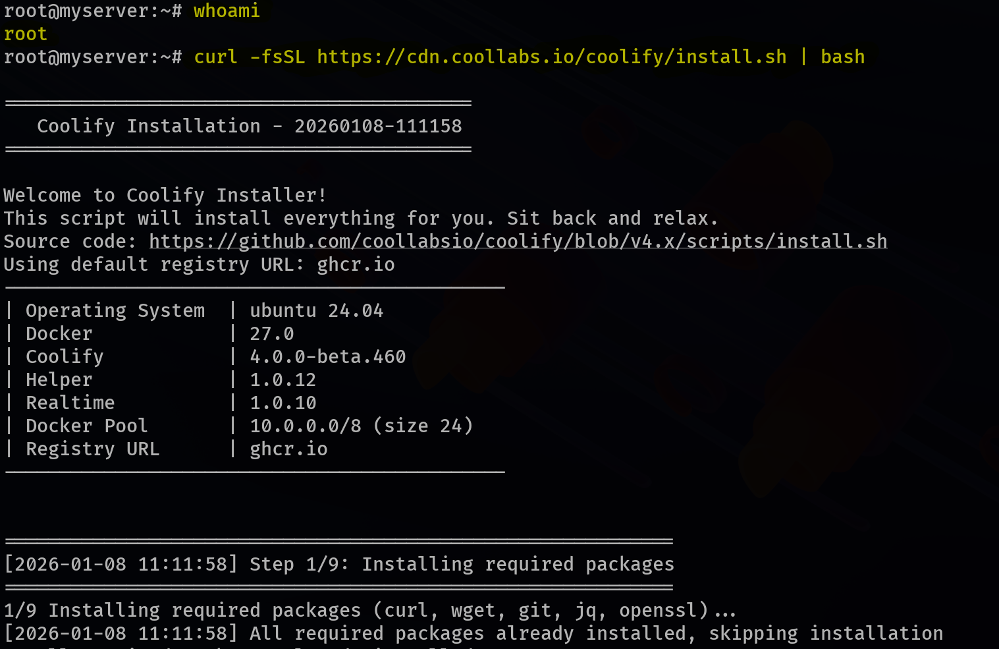

## Introduction

In this tutorial, we will cover how to set up a production-ready WordPress website on an Ubuntu instance using [Coolify](https://coolify.io/).

The whole process can be broken down into four steps: installing the Coolify engine in our instance, setting up our admin account on the Coolify dashboard and logging in, installing WordPress and MariaDB, and finally configuring our website to use a custom domain and HTTPS.

## Prerequisites

This tutorial assumes you already have an instance or server running `Ubuntu 22.04` and has the following recommended specs: 2 GB RAM, 30 GB storage space, and 2 cores. The firewall supporting the instance should be configured to allow the following ports to be open: `22, 80, 443, 8000`. One last item is to ensure you have a registered domain, and in your DNS server, the A record is pointed to our instance’s public IP address.

## Step 1 - Install the Coolify Engine

From the documentation ([link](https://coolify.io/docs/get-started/installation#self-hosted-installation)), installing Coolify can be achieved by running the following command as the `root` user:

```jsx
curl -fsSL https://cdn.coollabs.io/coolify/install.sh | bash
```

The installation can take around a minute to complete, as several packages are being installed and configured.



Once the installation is complete, a congratulations message is displayed, and a **public IP** address is printed, which we can use to access our Coolify dashboard (I have hidden it with the yellow line in the screenshot below).


The next step is to log in (or set up) our Coolify admin account.

## Step 2 - Log in to Coolify

Using the public IP above, visit a new tab on your browser and paste it there, and you should be presented with such a screen:


If you don’t have an account, you can fill in those fields and select **Create Account.** In the next screen, select `Skip Setup` to proceed to the dashboard.


You will be redirected to the dashboard, as shown below, and then we can proceed to install **WordPress** and **MariaDB.**


## Step 3 - Install WordPress (with MariaDB)

In the dashboard, navigate to the `Projects` menu on the right, and select the `+ Add` button at the top, and you’ll be presented with a dialog box, where you provide the name of your project (I’ll set my project name to `coolproject`) and then select `Continue`.


Once your project is created, select the `+ Add Resource` option, which allows us to install and deploy various applications/software on our server.


A ton of resources are shown. There’s a search bar at the top, and we can type `wordpress`, which is going to bring up around 6 options, and we can select the `WordPress with MariaDB` option.


Once you select it, we are directed to a configuration page, where we configure and customize our WordPress and MariaDB installation. For our case, and this is entirely optional, I’ll edit the ‘**Service Name’** field to `my-cool-website`. You can change/copy the MariaDB credentials (i.e., User, Password, Root Password) if you intend to use them later (for this tutorial, we won’t).


The next step is to select **‘Deploy’** at the top right, which installs and deploys the WordPress website and the MariaDB database. A pop-up appears displaying the service startup logs (mostly Docker logs). After a few seconds, your deployments are ready, and you can tell this from the dashboard, where we see the `Running (healthy)` tags at the top and bottom.


The website is up, and we can access it from the URL provided at the bottom (under Services, the URL below the WordPress title). The address is quite long, and you can select the pen icon next to it, which presents it in its whole form, and you can copy and paste it into a new browser tab.

 


The URL should take you to a WordPress setup page, where you get to finalize your WordPress installation. You start by selecting the language, and then proceed to set the site title, your username, password, and email.


Once you fill in these fields, the installation is complete, and you will be required to log in again, where you provide the username and password, and it should take you to the admin dashboard.


## Step 4 - Setting Up our Custom Domain

The website is technically ready and can be used, and we can now modify it to use our custom domain `<example.com>` and also use **HTTPS**.  Back in our Coolify dashboard, in the configuration page, where we copied the long URL, click the pen icon again, overwrite the long URL with our custom domain, and then select **Save** (make sure to prepend the domain with HTTPS).


*NB: By default, Coolify will automatically set up and install SSL certificates for your website once you enter a domain with the HTTPS protocol, and you literally don’t have to do anything else. More information can be found in their documentation here: [link](https://coolify.io/docs/knowledge-base/domains#https-ssl-certificates)*

Once you’re done, you need to redeploy your services, and this can be done by selecting the **Restart** button.


Now we can use our custom domain `<example.com>` to access our website.


## Conclusion

That’s all for deploying our WordPress website using Coolify. To further customize and configure your installation, you can view the knowledge base from Coolify here: [link](https://coolify.io/docs/knowledge-base/overview)