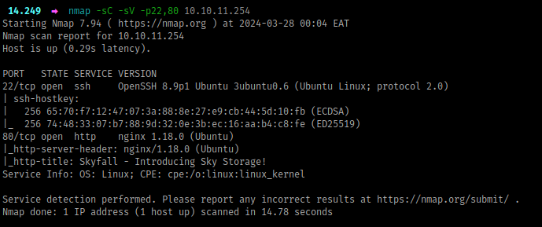

## Introduction

This was very cool and well-crafted box! It was rated `insane` but the HTB Community felt it was among the easier insane machines. There’s a ton of enumeration to do, let’s get right to it.

## Recon

Beginning with port scanning, I’ll run `rustscan -a <IP>` , which reveals port 22 and 80.

By default, that’s just SSH and some web server, respectively. I’ll follow up with `nmap`  to see if we can identify anything about the underlying host and the stack running the website.

Something to note from above:

- The target is most likely an `ubuntu` virtual machine
- The website is being served by `nginx`  as the proxy

Next, let’s check out the website:

## Looking for weaknesses

### The Website

Being an insane box, it’s meant to simulate a realistic black-box environment, so we’ll have to work through a lot of loopholes before we can find some vulnerability.

To begin, I just enter the IP address in the URL bar, and we can note a few things from the landing page:

- from the *favicon*, we’ve landed on some bootstrap static site. I confirmed by appending `index.html` to the IP address as shown below, and we get the same response. Also, from the *hero* displayed*,* our site deals with storage

- all of the links in the header are static, and as we scroll down, the site keeps talking about storage, until we reach *demo,* where we get an offer to try out the demo portal through a link `demo.skyfall.htb`  and before we head there, I’ll finish up with this page

- in the *team* section, we have three users provided together with domain emails i.e. `jbond`, `askyy` and `btanner` with the domain `skyfall.htb`
- lastly, a *contact* section is present but basically doesn’t do anything, instead reloads the page

To summarize, we got three important bits: we’re probably dealing with some storage service, we have **two** domains, and we have **three** potential users.

### The Demo Portal

First, I’ll add the domains to the `/etc/hosts` file:

Visiting the `demo.skyfall.htb` subdomain, we first land to a login page, which tells us we can login with the default credentials `guest:guest`  (it’s also worth noting the sort of path we were redirected to, `login` - possibly now we’re interacting with some web framework)

We proceed with `guest:guest` and we’re greeted with a dashboard. This dashboard has quite a lot of interesting things, which we’ll note down below;

- From the footer, the website is running `flask`, a popular python web framework
- We have some sort of *agile planning board*, that shows us what’s going on with this project. First, a lot is being mentioned on `MinIO`, which is an s3-compatible object storage service [[link](https://min.io/)]. It seems `MinIO` was integrated as the storage service backend and the feature is 100% complete, and assessing it’s storage security is an *in-progress* task (being 60% complete)
- Also, we can see some updates about users uploading objects today
- Lastly, we have a bunch of links on the left navigation pane

### Paths

/files

- There’s a file present called *welcome.pdf,* which was uploaded by guest, and we could download it and see what it contains. The only thing worth mentioning about that file is it’s written by `askyy` , so possibly this is going to be a user on the system.
- From the *download* feature, apparently you just pass the file name as an argument, and it returns the file contents. I tried many payloads looking for file traversal, but it was just a rabbit hole.
- Also, we have an *upload* feature, which you can try weird stuff, but it doesn’t yield anything (any weird characters you pass in the filename are *neutralized* to underscores😢)

/beta

- Now this is an interesting page, and from the landing page, we saw some beta features were being implemented but were just 10% complete. However, this page requires admin privileges, and this is the response we get. Before we attempt some bypasses, let’s look at the other pages and then we’ll be back.

/fetch

- This is an interesting feature/path, where we would pass in some URL and the response would be saved under the `/files` path. I tried to pass in some file traversal payloads i.e. `file:///etc/passwd` but it just erred out, i then setup a python local server and tried to fetch from the server, which succeeded and the response was saved under files. I then tried passing some maliciously crafted arguments on that url (e.g. `http://10.10.0.1:8008{{2*2}}` ) which produced a parsing error. I then tried doing some local fetch i.e. `http://demo.skyfall.htb/beta` and the server responded with a name resolution error. This doesn’t look exploitable, but if we run out of options later we’ll revisit

/metrics

- Based on the title that redirects us to this path, we should get *MinIO metrics,* but instead, we land on a **403** forbidden page.

Now, something is interesting here. If you’ve done web pentesting before, you possibly would realize this immediately. So, previously, under the **`/beta`** path, we also got a **403** response, but the pages are **different. `/beta`** returns a `200 OK` response but its contents represent a 403 page while **`/metrics`** returns a direct `403 Forbidden` response.

What this means is one page is being *restricted* by the web server (`/beta`) while the other page is being *restricted* by the `nginx` proxy (`/metrics`). From this, we can attempt some `nginx` bypasses.

Before I proceed, there’s an interesting article that talks about HTTP Parser inconsistencies, which you should have a look here [[link](https://rafa.hashnode.dev/exploiting-http-parsers-inconsistencies)]. It talks about bypassing reverse proxies and load balancers mainly due to the way path names are interpreted when using *special* characters.

Under the *‘**Bypassing Nginx ACL Rules With Flask*’** section from that site, we have some characters that can bypass `nginx` rules if it’s incorrectly configured.

From here, I’ll intercept the request using `BurpSuite` and try to append the path name with the character `\x85` and see if we’ll get a valid response. This returns a `404 NOT FOUND`  response. I try the rest of them, one by one in order. Upon reaching `\x0C` , we get a `200 OK`

### MinIO Internal Metrics

Now that we can access the `/metrics` page, we get a lot of internal metrics from the running `MinIO` server.

There’s a lot of info here about the running `MinIO` nodes, such as some API requests being made, but the most important info is right at the bottom.

Now we have the version and commit hash of the `MinIO` software running, which we can get from the official GitHub repository [[link](https://github.com/minio/minio)] and perhaps we can have a look at it. But before that, we have an endpoint to `MinIO` backend, let’s check it out.

A lot of info is displayed about the running `MinIO` cluster nodes, and we can see there are some *buckets* present for users, with the name of the users being the name of the buckets. Also, there’s a lot of requests being made to the buckets, such as `getobjects`, `putobject`, `listbuckets` etc. These requests, to make sense of them, you have to understand how `Amazon S3` works, and probably read some `MinIO` documentation.

### MinIO Vulnerabilities

Given the software version and commit info of `MinIO`, we can deduce a lot from it. They use a *timestamp* to mark the version releases. If you look at the version time, it was released a year ago on *2023-03-13.* A year is quite long, and that’s why you’re always advised to use the latest version of software.
If you ‘google’ for vulnerabilities in `MinIO`, we get two common vulnerabilities: *CVE-2023-28432* and *CVE-2023-28434.* From their blog site [[link](https://blog.min.io/security-advisory-stackedcves/)], the `MinIO` version on our target is the last affected version by both vulnerabilities.

We’ll put a lot of emphasis on the first CVE, as the second one is just another rabbit hole (it’s exploitable but not on the current target’s environment).

### CVE-2023-28432: Information Disclosure

From this blog [[link](https://www.pingsafe.com/blog/cve-2023-28432-minio-information-disclosure-vulnerability/)], we get details about this vulnerability and a *PoC,* which we’ll try to see if it can be used here. And true to this blog, we get some sensitive info (send a `POST` request to the `/minio/bootstrap/v1/verify` endpoint)

We get the `root` credentials to our `MinIO` server, which we can use and try to look for more ways of interacting with the server (from that site with the *PoC*, they talk about logging in to the web console but our target doesn’t have the web console enabled). Looking at the `MinIO` official documentation, there’s a binary client called `mc` that we can download and set up with those credentials [[link](https://min.io/docs/minio/linux/reference/minio-mc.html#)]

### Object-level Storage

first, I’ll get the binary: `wget https://dl.min.io/client/mc/release/linux-amd64/mc`

Next, I’ll create an *alias*, just as the docs suggest, and then confirm everything is working:

There are a lot of commands you can try out, but I’ll focus on the important ones. From the output above, there are 2 nodes containing 8 buckets and 12 objects. Let’s try to see if we can list out these buckets recursively and get the objects inside.

The bucket `askyy` has a backup file, that might be interesting. I’ll grab this file and try look for sensitive info (`MinIO` is s3-compatible - majority of these commands have a similar format to `awscli` when interacting with s3)

Now, we extract the file, and funny enough, there’s nothing here, which doesn’t make sense (even the *authorized_keys* file has only 1 byte)

So, if you’ve interacted with `Amazon S3` before, we usually have a versioning concept with buckets. Also, from the cluster metrics we got earlier, you could get a hint that there could be some versioning present in these buckets. Because we’re dealing with **‘Object Storage`,** if you ever upload an object into a bucket whose name is similar to an existing object in the bucket, then the existing object is replaced by the new object. To avoid unintended overwriting, buckets have a versioning feature, which allows you to restore objects to a previous version.

For this case, we’ll try to view all existing versions of objects present.

Now, we have three different versions of the *backup* file, and we’ll download them all, as they have different sizes, so possibly each is unique in some way.

From there, we extract them, and look for anything interesting. From the `v1`, we have a *terraform-generator* folder and the *.ssh* folder has a private key and in the *authorized_keys* file, `askyy` is allowed to ssh into the target machine. However, when you try to SSH, we get a password prompt, from which we can’t proceed.

Now, to spare us some time, the *terraform generator* is just another rabbit hole, nothing is going on there.

If you look at the other versions `v2` and `v3`, they look similar in terms of files present, but are slightly different memory-wise. That’s because some of their contents are slightly different too.

If you look at the `.bashrc` file between the two folders, they are slightly different. Let’s compare their contents with `diff` 

We have some gold, and they are some secrets, and we’ll try to understand what they do.

### The Vault

Well, we have an access token to some vault, which we do not know what software operates underneath it, or even how to interact with it. So, I just search on Google, ‘vault hvs token’ because the token starts with ‘*hvs*’

All results point to `Hashicorp`, so this is very likely a *Hashicorp* vault. From here, we’ll have to read through the docs (unless you interacted with this before), to understand how to use our token with the vault specified in the address. The docs can be found here [[link](https://developer.hashicorp.com/vault/api-docs)], and as much as it might take some time to get around them, I’ll proceed very slowly.

The first thing I’m going to look at is how to invoke authenticated requests using our token, where we can find more info under *auth,* then look for *token* [[link](https://developer.hashicorp.com/vault/api-docs)]. The path I’m going to try is `/v1/auth/token/lookup-self` which possibly shouldn’t fail.

Great. With that output, we can try more commands, and possibly use `jq` to view the *JSON* better. But before we try any other command, the previous command already gives us a lot of interesting information. Here’s the output in a better format.

Policies, especially with cloud services, can allow us to do things depending on the way they are defined. This token has some policies attached to it, `developer` and `default`. The former is rather interesting, and I’ll look for ways on how to view policy info from the docs.

Here, we have some interesting rules, highlighting actions that any entity attached to the `developer` policy can do. Let’s ‘zoom in’ on those actions and get a better view with `jq` 

The first capability is reading the *developer* policy which we’ve already done previously, now let’s try out the other two, which look interesting as they deal with SSH. I’ll try to do a list action in the *ssh* path, and of course following through the docs here [[link](https://developer.hashicorp.com/vault/api-docs/v1.15.x/secret/ssh#list-roles)]

We have to two ‘*key roles`,* one for *admin* and another for *dev*. From our capabilities earlier, we can only use the *dev* role with our token. Based on the context of what is happening, we have to authenticate through the ***OTP*** mechanism, which should be interesting.

Now, once you go through the docs, you’ll understand that we can generate *OTP* keys for SSH because the capabilities enabled under `ssh/creds/dev_otp_key_role` allow us to *create, read* and *update* the *OTP* keys. To do that, I’ll run the following command (the cmd is here [[link](https://developer.hashicorp.com/vault/api-docs/v1.15.x/secret/ssh#generate-ssh-credentials)])

We get a *one-time* password, which I’ll use to login via SSH as the user `askyy`

NB: Before I continue, when I was doing this machine, I found this API action which allowed me to view all the actions and capabilities present. I believe it’s not documented well based on all the info it provides on what our token can do: `GET <URL>/v1/sys/internal/ui/resultant-acl`. Try it out and lemme know what you think.

## Privilege Escalation

The first command I run is `sudo -l` , to look for `sudo` capabilities, and we get something

When you run the above `sudo` command with the *-v* or *verbose* mode flag, we get some interesting output.

 A ***master token*** is present in the config file, and when you think about it, it might be used to generate the *OTP* key using the `admin_otp_key_role` , and because it’s *admin* possibly allow us to SSH as *root*.

 Now, let’s try to run the previous command with the flag *-d* or *debug* mode

A new file called `debug.log` has been created. This file however is only owned by *root*. 

When I was doing this box, in order to get to root, you just had to create the file `debug.log` in the current working directory as the user `askyy` and then run the command again, which allows the log information to be saved inside that file but the file still belongs to the `askyy` user, thus you can read its contents. Once you get the *master token*, you can now use it to generate an *OTP* key that logs you in as the *root* user. However, this was unintended, according to the box author.

## Conclusion

Other than the root step, this box had a lot of things to learn. I took approximately 3 days to complete after it was released, and I really enjoyed. In case of any queries, feel free to ping me.